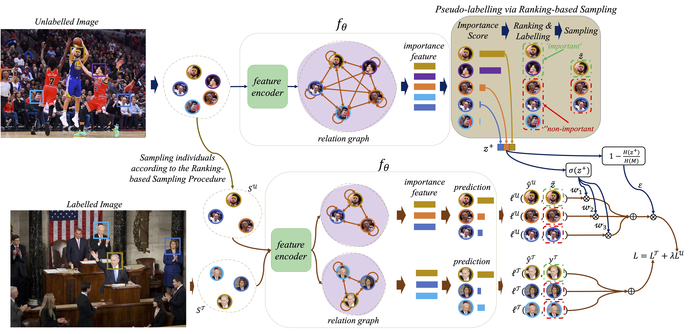

## Semi-POINT 
This repository contains an official pytorch implementation for the following paper:<br>
[Learning to Detect Important People in Unlabelled Images for Semi-supervised Important People Detection (CVPR 2020)](https://harlanhong.github.io/publication/learning-to-rank). [Fa-Ting Hong](https://harlanhong.github.io/) [Wei-Hong Li](https://weihonglee.github.io/), [Wei-Shi Zheng](http://isee.sysu.edu.cn/~zhwshi/)

In order to save the cost on annotation, we develop a semi-supervised method on important people detection task. In this work, we mainly propose three strategies to address the challenges the bring by the massive unlabelled data.
<!--TODO-->
### **Citation**
Please kindly cite our paper (and the respective papers of the methods used) if you use this code in your own work:<br><br>
Fa-Ting Hong, Wei-Hong Li, Wei-Shi Zheng, "Learning to Detect Important People in Unlabelled Images for Semi-supervised Important People Detection", In CVPR, 2020.

bib:
    @inproceedings{hong@learning,
     title={Learning to Detect Important People in Unlabelled Images for Semi-supervised Important People Detection},
     author={Fa-Ting Hong, Wei-Hong Li and Wei-Shi, Zheng},
     year={2020},
     booktitle={IEEE International Conference on Computer Vision and Pattern Recognition (CVPR)},
    }
### **Dependencies**
    1.Pytorch 1.0.0
    2.Python 3.6+
    3.Python packages: numpy, scipy, pyyaml/yaml, h5py, opencv, PIL


### **DataSet**
In this work, we apply our algrithm to the MS Dataset and NCAA Dataset, and achieve satisfactory results. 

Download the [EMS Dataset](https://mail2sysueducn-my.sharepoint.com/:u:/g/personal/hongft3_mail2_sysu_edu_cn/ETuCvaHTmgVHoJ0CscBZV7oBBMoF_OqE3EEoAJ_l7K2Lqw?e=luF4Mf) and [ENCAA Dataset](https://mail2sysueducn-my.sharepoint.com/:u:/g/personal/hongft3_mail2_sysu_edu_cn/EUyT_9kkfQtHgUBrVXHgnXUBc7P9SBsqKJ0CmhSu4P7OOw?e=ujOzjz), and unzip it into /data. After this step, you should have a folder structure:

    - MSDataset/NCAADataset
        - data
        - images
        - README.md
### **Data Prepare**

As we mentioned in the paper, we use the interior and exterior patches and the location heat map. To train the POINT, we first extract those patches from the original images. As the detectors used to detect persons in MS Dataset and NCAA Dataset are different, we provide two different scripts to extract those patches:

    python GetMSImageFace.py (For Ms Dataset)
**or**

    python GetNCAAImageFace.py (For NCAA Dataset)
The picture below is an illustration of extracting the exterior patch on the MS Dataset (left) and the NCAA Dataset (right).


&nbsp;&nbsp;&nbsp;&nbsp;&nbsp;&nbsp;


### **Train**
Run the below conmmand to train the POINT<br>

```bash
CUDA_LAUNCH_BLOCKING=1 CUDA_VISIBLE_DEVICES=1 python Ours_tnrankS_ISW_EW.py --optimizer ADAM --lr 0.0001 --save_name Ours_tnrankS_ISW_EW_adam --consistency-loss Learn_Prior_uncertainty_mse_loss --label-propagation LabelPropagation_scale --consistency-rampup 8750 --consistency 1 --rampup-type linear_rampup  --rampup-per-step --epochs 10000 --training-step 250 --threshold 0.99 --dataset_path /data/fating/ProcessDataset/MSDatasetV2_process --index_name /data/fating/OriginalDataset/MSDatasetv2/data/MSexpand_DSFD.npy 
```
### **Test**

To test the trained model, we provide a script to evaluate the important people detection performance on the testing set. After testing, both mAP and CMC are calculated.

```bash
CUDA_VISIBLE_DEVICES=3 python test.py  --test-savename EMS_ALL --model ../models2/best_Ours_tnrankS_ISW_EW_0.99.pkl --dataset_path /data/fating/ProcessDataset/MSDatasetV2_process --index_name /data/fating/OriginalDataset/MSDatasetv2/data/MSexpand_DSFD.npy
```
### **Results**
More results can be viewed in our paper: https://arxiv.org/abs/2004.07568.

### More works about me
please view my personal page: https://harlanhong.github.io


